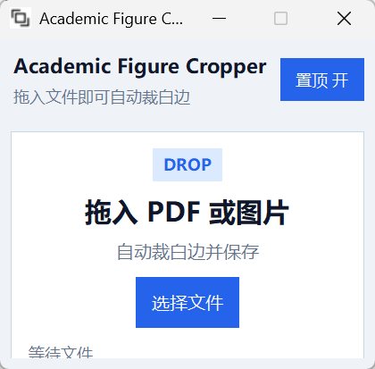

# Academic Figure Cropper

一个面向论文截图整理的小工具。把 PDF 或图片直接拖进窗口，程序会自动裁掉白边，并按你的设置覆盖原文件或输出到指定目录。

## 功能特性

- 支持拖放 PDF 和常见图片格式
- 自动裁剪四周白边
- 支持覆盖原文件或输出到指定目录
- 支持统一留白，也支持分别设置上下左右留白
- 支持窗口置顶，方便从其他窗口拖文件过来
- 打包后可直接运行，无需手动安装 Python 环境

## 使用截图

把截图放到 `docs/screenshots/app-main.png` 后，取消下面这行注释即可：




## 支持格式

- PDF
- JPG / JPEG
- PNG
- BMP
- TIFF / TIF
- GIF

## 使用方法

1. 启动程序。
2. 直接把 PDF 或图片拖进窗口，或者点击“选择文件”。
3. 选择输出方式：
   - `覆盖原文件`：处理完成后直接替换原文件。
   - `输出到目录`：保存到你指定的文件夹。
4. 按需设置“留白”。
   - `0 px` 表示贴边裁剪，不额外保留空白。
   - 大于 `0 px` 表示裁剪后额外保留边距。
5. 等待处理完成。

## 输出目录说明

当你切换到 `输出到目录` 模式后：

1. 在界面中的输出目录输入框里直接填写路径，或点击“浏览”选择文件夹。
2. 点击“打开”可以直接打开当前输出目录。
3. 如果目录中已经存在同名文件，程序会自动追加后缀避免覆盖。

## 运行源码

先安装依赖：

```bash
pip install -r requirements.txt
```

然后启动：

```bash
python main.py
```

## 一键打包

项目根目录已经提供 `build.bat`。

直接双击运行，或在终端执行：

```bat
build.bat
```

打包脚本会：

- 自动创建独立构建环境 `.build-venv`
- 安装所需依赖
- 使用 `icon.ico` 作为程序图标
- 生成 `dist/AcademicFigureCropper.exe`

## 依赖

见 [requirements.txt](/C:/Users/dell/Desktop/AcademicFigureCropper/requirements.txt)。

当前主要依赖包括：

- `numpy`
- `Pillow`
- `PyMuPDF`
- `tkinterdnd2`
- `pyinstaller`

## 配置文件

程序会自动保存你的常用设置，例如：

- 是否覆盖原文件
- 输出目录
- 留白参数
- 是否置顶

配置文件名为 `pdf_cropper_config.ini`。

## 项目结构

```text
AcademicFigureCropper/
├─ main.py
├─ build.bat
├─ AcademicFigureCropper.spec
├─ requirements.txt
├─ icon.ico
└─ README.md
```

## 说明

- 当前打包流程主要面向 Windows。
- 如果你使用的是源码运行方式，系统需要可用的 Tk 环境。
